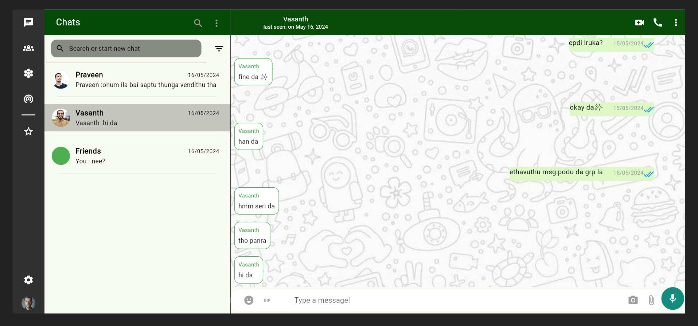

# Persistent Distributed Chat App Client

## Description
The client-side component of a persistent distributed chat application, built with Flutter. This frontend connects to the server via Socket.io and includes advanced features such as private messaging, group chat, real-time updates, and phone authentication. The app uses Provider for state management to ensure efficient and scalable state handling across the application.

## Features
- **Responsive UI**: Optimized for both mobile and web/desktop screen sizes.
- **Phone Authentication**: Uses Firebase for phone authentication.
- **Real-time Messaging**: Connects to the backend using Socket.io.
- **Private and Group Chats**: Supports individual and group messaging.
- **Notifications**: Alerts for incoming messages when the user is active.
- **Advanced Messaging Features**: Includes message sent/read receipts, online/last seen status, and unread message counts.
- **Provider State Management**: Efficient and scalable state management using Provider.
- **Future Enhancements**: Plans to integrate audio, photo, and video sharing.

## Technologies Used
- Flutter
- Firebase Phone Auth
- Firebase Storage
- Socket.io Client
- Provider State Management

## Installation Instructions

1. **Clone the repository**:
   ```sh
   git clone https://github.com/Althaf-codes/Chat-app-flutter.git
   cd Chat-app-flutter

2. Install Flutter dependencies:
   ```sh
   flutter pub get

3. Set up Firebase:
   Follow the instructions from Firebase docs to add Firebase to your Flutter app

5. Run the app:
   ```sh
   flutter run

## Screenshots





## Created Date
This project was created on January 10, 2024.
